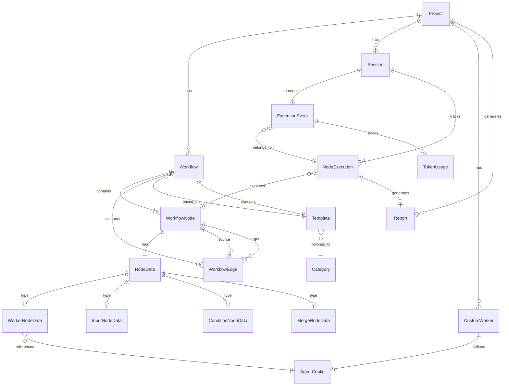

# DATABASE.md

Claude Flow v4.0.0 데이터 아키텍처 문서

---

## 📚 관련 문서

- **[문서 INDEX](INDEX.md)** - 모든 문서의 전체 목록
- **[아키텍처](architecture.md)** - 시스템 설계 및 컴포넌트
- **[코드 레퍼런스](code-reference.md)** - 핵심 클래스 및 함수
- **[API 레퍼런스](api.md)** - REST API 엔드포인트
- **[프로젝트 문서](../CLAUDE.md)** - 프로젝트 개요

---

## 목차

1. [개요](#개요)
2. [현재 데이터 아키텍처 (파일 기반)](#현재-데이터-아키텍처-파일-기반)
3. [논리적 데이터 모델 (ERD)](#논리적-데이터-모델-erd)
4. [엔티티 상세](#엔티티-상세)
5. [파일 스토리지 구조](#파일-스토리지-구조)
6. [향후 RDBMS 마이그레이션 계획](#향후-rdbms-마이그레이션-계획)
7. [데이터 정규화 분석](#데이터-정규화-분석)
8. [인덱싱 전략](#인덱싱-전략)
9. [마이그레이션 히스토리](#마이그레이션-히스토리)

---

## 개요

### 프로젝트 정보
- **프로젝트명**: Claude Flow
- **버전**: 4.0.0
- **역할**: AI 에이전트 기반 워크플로우 오케스트레이션 시스템
- **데이터 저장 방식**: 파일 기반 (JSON, TXT, LOG)

### 데이터 아키텍처 특징
- **파일 기반 스토리지**: 관계형 DB 대신 JSON 파일로 데이터 관리
- **프로젝트별 격리**: 각 프로젝트마다 독립적인 디렉토리 구조
- **세션 기반**: Claude SDK 세션을 JSONL 파일로 유지
- **확장성**: 향후 PostgreSQL/MongoDB 마이그레이션 가능

### 주요 데이터 엔티티
1. **Workflow** - 워크플로우 정의 (노드, 엣지, 메타데이터)
2. **WorkflowNode** - 워크플로우 노드 (Worker, Input, Condition, Merge)
3. **WorkflowEdge** - 노드 간 연결
4. **Session** - 워크플로우 실행 세션
5. **Template** - 워크플로우 템플릿
6. **CustomWorker** - 사용자 정의 Worker 에이전트
7. **AgentConfig** - AI 에이전트 설정
8. **ExecutionEvent** - 실행 이벤트 (SSE 스트리밍)
9. **Log** - 시스템 로그
10. **Report** - 노드별 작업 보고서

---

## 현재 데이터 아키텍처 (파일 기반)

### 디렉토리 구조

```
~/.claude-flow/                             # 사용자 홈 디렉토리
├── .env                                    # 환경변수 (CLAUDE_CODE_OAUTH_TOKEN)
├── templates/                              # 사용자 템플릿
│   └── {template_id}.json                  # 템플릿 JSON
├── workflows/                              # 전역 워크플로우 (사용 안 함)
└── {project_name}/                         # 프로젝트별 디렉토리
    ├── workflows/                          # 저장된 워크플로우
    │   └── {workflow_id}.json
    ├── web-sessions/                       # 웹 실행 세션
    │   └── {session_id}.json               # 세션 상태 (노드 출력, 이벤트 등)
    ├── logs/                               # 시스템 로그
    │   ├── system_YYYYMMDD.log             # 시스템 로그
    │   ├── debug_YYYYMMDD.log              # 디버그 로그
    │   ├── info_YYYYMMDD.log               # 정보 로그
    │   └── error_YYYYMMDD.log              # 에러 로그
    └── reports/                            # 노드별 작업 보고서
        └── YYYYMMDD_HHmmss_{node_id}_{agent_type}.txt

{project_root}/.claude-flow/                # 프로젝트 루트 (Git 저장소)
├── workflow-config.json                    # 프로젝트 기본 워크플로우
├── worker/                                 # 커스텀 워커
│   └── {worker_name}.txt                   # 워커 프롬프트
└── worker-config.json                      # 커스텀 워커 설정

~/.claude/projects/{project_name}/          # Claude SDK 세션
└── *.jsonl                                 # Claude SDK 대화 세션
```

### 파일 형식

| 파일 타입 | 형식 | 크기 제한 | 용도 |
|----------|------|----------|------|
| Workflow | JSON | ~10KB | 워크플로우 정의 (노드, 엣지) |
| Session | JSON | ~100KB-1MB | 실행 세션 (이벤트, 출력, 상태) |
| Template | JSON | ~15KB | 워크플로우 템플릿 |
| Log | TXT | 무제한 | 구조화 로깅 (structlog) |
| Report | TXT/MD | ~50KB | 노드별 작업 보고서 |
| CustomWorker | TXT | ~5KB | 시스템 프롬프트 |
| SDK Session | JSONL | ~1MB-10MB | Claude SDK 대화 기록 |

---

## 논리적 데이터 모델 (ERD)

### 핵심 엔티티 관계도 (Mermaid)



### 관계 설명

| 관계 | 카디널리티 | 설명 |
|-----|-----------|------|
| Project ↔ Workflow | 1:N | 프로젝트는 여러 워크플로우를 가짐 |
| Project ↔ Session | 1:N | 프로젝트는 여러 실행 세션을 가짐 |
| Workflow ↔ WorkflowNode | 1:N | 워크플로우는 여러 노드를 포함 |
| Workflow ↔ WorkflowEdge | 1:N | 워크플로우는 여러 엣지를 포함 |
| WorkflowNode ↔ NodeData | 1:1 | 노드는 하나의 데이터를 가짐 (Union 타입) |
| WorkerNodeData ↔ AgentConfig | N:1 | 여러 Worker 노드가 같은 에이전트 설정 참조 |
| Session ↔ ExecutionEvent | 1:N | 세션은 여러 실행 이벤트 생성 |
| NodeExecution ↔ Report | 1:0..1 | 노드 실행은 최대 1개의 보고서 생성 |

---

## 엔티티 상세

### 1. Project (프로젝트)

**설명**: Git 저장소 단위의 프로젝트

**필드**:

| 필드명 | 타입 | 제약조건 | 설명 |
|--------|------|----------|------|
| project_path | String | PRIMARY KEY, NOT NULL | 프로젝트 절대 경로 |
| project_name | String | UNIQUE, NOT NULL | 프로젝트 디렉토리명 |
| workflow_config_path | String | NULL | 프로젝트 기본 워크플로우 경로 |
| created_at | DateTime | NOT NULL | 프로젝트 등록 시각 |
| last_accessed_at | DateTime | NULL | 마지막 접근 시각 |

**파일 위치**: `~/.claude-flow/{project_name}/`

**인덱스**: PRIMARY KEY (project_path), UNIQUE (project_name)

---

### 2. Workflow (워크플로우)

**설명**: AI 에이전트 워크플로우 정의

**필드**:

| 필드명 | 타입 | 제약조건 | 설명 |
|--------|------|----------|------|
| id | UUID | PRIMARY KEY | 워크플로우 고유 ID |
| name | String(255) | NOT NULL | 워크플로우 이름 |
| description | Text | NULL | 워크플로우 설명 |
| project_path | String | FOREIGN KEY → Project.project_path | 프로젝트 경로 |
| template_id | UUID | FOREIGN KEY → Template.id, NULL | 기반 템플릿 ID |
| nodes | JSON | NOT NULL | 노드 목록 (JSON 배열) |
| edges | JSON | NOT NULL | 엣지 목록 (JSON 배열) |
| metadata | JSON | NULL | 추가 메타데이터 |
| created_at | DateTime | NOT NULL, DEFAULT NOW() | 생성 시각 |
| updated_at | DateTime | NOT NULL, DEFAULT NOW() | 수정 시각 |

**파일 위치**: `~/.claude-flow/{project_name}/workflows/{id}.json`

**파일 구조**:
```json
{
  "id": "uuid-v4",
  "name": "Code Review Workflow",
  "description": "Automated code review pipeline",
  "nodes": [
    {
      "id": "node_1",
      "type": "input",
      "position": {"x": 100, "y": 100},
      "data": {
        "initial_input": "Review this code",
        "parallel_execution": false
      }
    }
  ],
  "edges": [
    {
      "id": "edge_1",
      "source": "node_1",
      "target": "node_2"
    }
  ],
  "metadata": {}
}
```

**인덱스**:
- PRIMARY KEY (id)
- INDEX (project_path, created_at) - 프로젝트별 워크플로우 목록 조회
- INDEX (template_id) - 템플릿별 워크플로우 조회

---

### 3. WorkflowNode (워크플로우 노드)

**설명**: 워크플로우의 개별 노드 (Workflow.nodes 배열의 요소)

**필드**:

| 필드명 | 타입 | 제약조건 | 설명 |
|--------|------|----------|------|
| id | String | PRIMARY KEY | 노드 고유 ID (workflow 내에서 unique) |
| workflow_id | UUID | FOREIGN KEY → Workflow.id | 워크플로우 ID |
| type | Enum | NOT NULL | 노드 타입 (worker, input, condition, merge) |
| position | JSON | NOT NULL | 캔버스 위치 {"x": float, "y": float} |
| data | JSON | NOT NULL | 노드 데이터 (타입별로 다름) |

**노드 타입**:
- `worker`: Worker Agent 실행
- `input`: 워크플로우 시작점
- `condition`: 조건 분기
- `merge`: 분기 병합

**파일 위치**: Workflow JSON 내부 (`nodes` 배열)

**인덱스**:
- PRIMARY KEY (id, workflow_id) - 복합 키
- INDEX (workflow_id) - 워크플로우별 노드 조회
- INDEX (type) - 노드 타입별 조회

---

### 4. NodeData (노드 데이터) - Union 타입

**설명**: 노드 타입별 데이터 (Discriminated Union)

#### 4-1. WorkerNodeData (Worker 노드)

| 필드명 | 타입 | 제약조건 | 설명 |
|--------|------|----------|------|
| agent_name | String(100) | NOT NULL | Worker Agent 이름 |
| task_template | Text | NOT NULL | 작업 템플릿 (Jinja2, {{input}} 등) |
| allowed_tools | JSON Array | NULL | 허용 도구 목록 |
| thinking | Boolean | NULL | Thinking 모드 활성화 |
| output_extraction | JSON | NULL | 출력 추출 설정 (OutputExtractionConfig) |
| parallel_execution | Boolean | DEFAULT false | 자식 노드 병렬 실행 여부 |
| config | JSON | NULL | 추가 설정 |

**OutputExtractionConfig**:
```json
{
  "strategy": "full | last_block | between_markers",
  "start_marker": "---START---",
  "end_marker": "---END---"
}
```

#### 4-2. InputNodeData (Input 노드)

| 필드명 | 타입 | 제약조건 | 설명 |
|--------|------|----------|------|
| initial_input | Text | NOT NULL | 초기 입력 텍스트 |
| parallel_execution | Boolean | DEFAULT false | 자식 노드 병렬 실행 여부 |

#### 4-3. ConditionNodeData (Condition 노드)

| 필드명 | 타입 | 제약조건 | 설명 |
|--------|------|----------|------|
| condition_type | Enum | NOT NULL | 조건 타입 (contains, regex, length, custom, llm) |
| condition_value | String | NOT NULL | 조건 값 |
| true_branch_id | String | NULL | True 경로 노드 ID |
| false_branch_id | String | NULL | False 경로 노드 ID |
| max_iterations | Integer | NULL | 최대 반복 횟수 (피드백 루프 제한) |
| parallel_execution | Boolean | DEFAULT false | 자식 노드 병렬 실행 여부 |

#### 4-4. MergeNodeData (Merge 노드)

| 필드명 | 타입 | 제약조건 | 설명 |
|--------|------|----------|------|
| merge_strategy | Enum | NOT NULL | 병합 전략 (concatenate, first, last, custom) |
| separator | String | DEFAULT "\n\n---\n\n" | 결합 구분자 (concatenate 시) |
| custom_template | Text | NULL | 커스텀 병합 템플릿 |
| parallel_execution | Boolean | DEFAULT false | 자식 노드 병렬 실행 여부 |

---

### 5. WorkflowEdge (워크플로우 엣지)

**설명**: 노드 간 연결 (Workflow.edges 배열의 요소)

**필드**:

| 필드명 | 타입 | 제약조건 | 설명 |
|--------|------|----------|------|
| id | String | PRIMARY KEY | 엣지 고유 ID |
| workflow_id | UUID | FOREIGN KEY → Workflow.id | 워크플로우 ID |
| source | String | FOREIGN KEY → WorkflowNode.id | 시작 노드 ID |
| target | String | FOREIGN KEY → WorkflowNode.id | 종료 노드 ID |
| sourceHandle | String | NULL | 시작 핸들 ID (조건 분기: "true", "false") |
| targetHandle | String | NULL | 종료 핸들 ID |

**파일 위치**: Workflow JSON 내부 (`edges` 배열)

**인덱스**:
- PRIMARY KEY (id, workflow_id)
- INDEX (source) - 시작 노드로 엣지 조회
- INDEX (target) - 종료 노드로 엣지 조회

**제약조건**:
- UNIQUE (source, target, sourceHandle) - 중복 엣지 방지
- CHECK (source != target) - 자기 자신으로의 엣지 방지 (순환은 허용)

---

### 6. Session (실행 세션)

**설명**: 워크플로우 실행 세션 (실시간 상태 추적)

**필드**:

| 필드명 | 타입 | 제약조건 | 설명 |
|--------|------|----------|------|
| session_id | UUID | PRIMARY KEY | 세션 고유 ID |
| project_path | String | FOREIGN KEY → Project.project_path | 프로젝트 경로 |
| workflow_id | UUID | FOREIGN KEY → Workflow.id, NULL | 워크플로우 ID |
| workflow_snapshot | JSON | NOT NULL | 워크플로우 스냅샷 (실행 시점 상태) |
| initial_input | Text | NOT NULL | 초기 입력 |
| start_node_id | String | NULL | 시작 노드 ID |
| status | Enum | NOT NULL | 세션 상태 (running, completed, error, cancelled) |
| node_sessions | JSON | NOT NULL | 노드별 SDK 세션 ID 매핑 |
| node_outputs | JSON | NOT NULL | 노드별 출력 저장 |
| events | JSON Array | NOT NULL | 실행 이벤트 목록 |
| total_token_usage | JSON | NULL | 전체 토큰 사용량 |
| error_message | Text | NULL | 에러 메시지 (status=error 시) |
| created_at | DateTime | NOT NULL, DEFAULT NOW() | 세션 생성 시각 |
| started_at | DateTime | NULL | 실행 시작 시각 |
| completed_at | DateTime | NULL | 실행 완료 시각 |
| updated_at | DateTime | NOT NULL, DEFAULT NOW() | 마지막 업데이트 시각 |

**파일 위치**: `~/.claude-flow/{project_name}/web-sessions/{session_id}.json`

**파일 구조**:
```json
{
  "session_id": "uuid-v4",
  "project_path": "/Users/user/project",
  "workflow_id": "workflow-uuid",
  "workflow_snapshot": { /* Workflow */ },
  "initial_input": "User input",
  "start_node_id": "node_1",
  "status": "completed",
  "node_sessions": {
    "node_1": "claude-sdk-session-id-1",
    "node_2": "claude-sdk-session-id-2"
  },
  "node_outputs": {
    "node_1": "Output text from node 1",
    "node_2": "Output text from node 2"
  },
  "events": [ /* ExecutionEvent[] */ ],
  "total_token_usage": {
    "input_tokens": 1000,
    "output_tokens": 500,
    "total_tokens": 1500
  },
  "error_message": null,
  "created_at": "2025-11-05T10:00:00Z",
  "started_at": "2025-11-05T10:00:01Z",
  "completed_at": "2025-11-05T10:05:30Z",
  "updated_at": "2025-11-05T10:05:30Z"
}
```

**인덱스**:
- PRIMARY KEY (session_id)
- INDEX (project_path, created_at DESC) - 프로젝트별 세션 목록 (최신순)
- INDEX (status) - 상태별 세션 필터링
- INDEX (workflow_id) - 워크플로우별 세션 조회

---

### 7. ExecutionEvent (실행 이벤트)

**설명**: SSE 스트리밍 이벤트 (Session.events 배열의 요소)

**필드**:

| 필드명 | 타입 | 제약조건 | 설명 |
|--------|------|----------|------|
| event_index | Integer | PRIMARY KEY | 이벤트 인덱스 (0부터 시작) |
| session_id | UUID | FOREIGN KEY → Session.session_id | 세션 ID |
| event_type | Enum | NOT NULL | 이벤트 타입 |
| node_id | String | NULL | 노드 ID |
| data | JSON | NOT NULL | 이벤트 데이터 |
| timestamp | DateTime | NOT NULL | 이벤트 발생 시각 |
| elapsed_time | Float | NULL | 노드 실행 경과 시간 (초) |
| token_usage | JSON | NULL | 토큰 사용량 (TokenUsage) |

**이벤트 타입**:
- `workflow_start`: 워크플로우 시작
- `node_start`: 노드 실행 시작
- `node_output`: 노드 출력 (스트리밍 청크)
- `node_complete`: 노드 실행 완료
- `node_error`: 노드 실행 에러
- `node_cancelled`: 노드 실행 취소
- `workflow_complete`: 워크플로우 완료
- `workflow_error`: 워크플로우 에러
- `ask_user`: 사용자 입력 요청 (Human-in-the-Loop)

**파일 위치**: Session JSON 내부 (`events` 배열)

**인덱스**:
- PRIMARY KEY (event_index, session_id)
- INDEX (session_id, timestamp) - 세션별 이벤트 시계열 조회
- INDEX (event_type) - 이벤트 타입별 필터링

---

### 8. Template (워크플로우 템플릿)

**설명**: 재사용 가능한 워크플로우 템플릿

**필드**:

| 필드명 | 타입 | 제약조건 | 설명 |
|--------|------|----------|------|
| id | UUID | PRIMARY KEY | 템플릿 고유 ID |
| name | String(255) | NOT NULL | 템플릿 이름 |
| description | Text | NULL | 템플릿 설명 |
| category | String(100) | NOT NULL | 카테고리 (code_review, testing, planning 등) |
| workflow | JSON | NOT NULL | 워크플로우 정의 (Workflow 구조) |
| thumbnail | String(500) | NULL | 썸네일 URL |
| tags | JSON Array | NULL | 태그 목록 |
| is_builtin | Boolean | NOT NULL, DEFAULT false | 내장 템플릿 여부 (삭제 불가) |
| metadata | JSON | NULL | 추가 메타데이터 |
| created_at | DateTime | NOT NULL, DEFAULT NOW() | 생성 시각 |
| updated_at | DateTime | NOT NULL, DEFAULT NOW() | 수정 시각 |

**파일 위치**:
- 내장: `{project_root}/templates/{id}.json` (읽기 전용)
- 사용자: `~/.claude-flow/templates/{id}.json` (CRUD 가능)

**인덱스**:
- PRIMARY KEY (id)
- INDEX (category) - 카테고리별 템플릿 조회
- INDEX (is_builtin) - 내장/사용자 템플릿 필터링
- FULLTEXT INDEX (name, description, tags) - 텍스트 검색

---

### 9. CustomWorker (커스텀 워커)

**설명**: 사용자 정의 Worker Agent

**필드**:

| 필드명 | 타입 | 제약조건 | 설명 |
|--------|------|----------|------|
| worker_name | String(100) | PRIMARY KEY | 워커 이름 |
| project_path | String | FOREIGN KEY → Project.project_path | 프로젝트 경로 |
| role | String(255) | NOT NULL | 워커 역할 설명 |
| prompt_content | Text | NOT NULL | 시스템 프롬프트 |
| prompt_file_path | String | NOT NULL | 프롬프트 파일 경로 |
| allowed_tools | JSON Array | NOT NULL | 허용 도구 목록 |
| model | String(100) | NOT NULL | Claude 모델명 |
| thinking | Boolean | NOT NULL, DEFAULT false | Thinking 모드 활성화 |
| created_at | DateTime | NOT NULL, DEFAULT NOW() | 생성 시각 |
| updated_at | DateTime | NOT NULL, DEFAULT NOW() | 수정 시각 |

**파일 위치**:
- 프롬프트: `{project_root}/.claude-flow/worker/{worker_name}.txt`
- 설정: `{project_root}/.claude-flow/worker-config.json`

**파일 구조** (worker-config.json):
```json
{
  "agents": [
    {
      "name": "custom_reviewer",
      "role": "Custom code reviewer",
      "system_prompt_file": ".claude-flow/worker/custom_reviewer.txt",
      "allowed_tools": ["read", "grep", "glob"],
      "model": "claude-sonnet-4-5-20250929",
      "thinking": true
    }
  ]
}
```

**인덱스**:
- PRIMARY KEY (worker_name, project_path) - 복합 키
- INDEX (project_path) - 프로젝트별 커스텀 워커 조회

---

### 10. AgentConfig (에이전트 설정)

**설명**: Worker Agent의 실행 설정 (도메인 모델)

**필드**:

| 필드명 | 타입 | 제약조건 | 설명 |
|--------|------|----------|------|
| name | String(100) | PRIMARY KEY | 에이전트 식별자 |
| role | String(255) | NOT NULL | 에이전트 역할 설명 |
| system_prompt | Text | NOT NULL | 시스템 프롬프트 (또는 파일 경로) |
| allowed_tools | JSON Array | NOT NULL | 허용 도구 목록 |
| model | String(100) | NOT NULL, DEFAULT "claude-sonnet-4" | Claude 모델명 |
| thinking | Boolean | NOT NULL, DEFAULT false | Thinking 모드 활성화 |

**허용 도구 목록**:
- `read`: 파일 읽기
- `write`: 파일 쓰기
- `edit`: 파일 수정
- `bash`: 터미널 명령 실행
- `glob`: 파일 검색
- `grep`: 텍스트 검색

**파일 위치**:
- 내장: `{project_root}/config/agent_config.json`
- 프롬프트: `{project_root}/prompts/{agent_name}.txt` (자동 스캔)

**인덱스**:
- PRIMARY KEY (name)

---

### 11. Report (작업 보고서)

**설명**: 노드별 작업 보고서 (Worker 실행 결과)

**필드**:

| 필드명 | 타입 | 제약조건 | 설명 |
|--------|------|----------|------|
| report_id | UUID | PRIMARY KEY | 보고서 고유 ID |
| project_path | String | FOREIGN KEY → Project.project_path | 프로젝트 경로 |
| session_id | UUID | FOREIGN KEY → Session.session_id, NULL | 세션 ID |
| node_id | String | NOT NULL | 노드 ID |
| agent_type | String(100) | NOT NULL | 에이전트 타입 (agent_name) |
| file_name | String(255) | NOT NULL | 파일명 |
| file_path | String | NOT NULL | 파일 절대 경로 |
| content | Text | NOT NULL | 보고서 내용 |
| file_size | Integer | NOT NULL | 파일 크기 (bytes) |
| extension | String(10) | NOT NULL | 파일 확장자 (txt, md) |
| created_at | DateTime | NOT NULL, DEFAULT NOW() | 생성 시각 |

**파일 위치**: `~/.claude-flow/{project_name}/reports/YYYYMMDD_HHmmss_{node_id}_{agent_type}.txt`

**파일명 패턴**: `{YYYYMMDD}_{HHmmss}_{node_id}_{agent_type}.{ext}`

**예시**: `20251105_173045_worker_1_backend_coder.txt`

**인덱스**:
- PRIMARY KEY (report_id)
- INDEX (project_path, created_at DESC) - 프로젝트별 보고서 목록 (최신순)
- INDEX (node_id) - 노드별 보고서 조회
- INDEX (agent_type) - 에이전트 타입별 조회
- INDEX (session_id) - 세션별 보고서 조회

---

### 12. Log (시스템 로그)

**설명**: 시스템 로그 (structlog 기반)

**필드**:

| 필드명 | 타입 | 제약조건 | 설명 |
|--------|------|----------|------|
| log_id | UUID | PRIMARY KEY | 로그 고유 ID |
| project_path | String | FOREIGN KEY → Project.project_path | 프로젝트 경로 |
| level | Enum | NOT NULL | 로그 레벨 (DEBUG, INFO, WARNING, ERROR, CRITICAL) |
| message | Text | NOT NULL | 로그 메시지 |
| component | String(100) | NULL | 컴포넌트명 (예: WorkflowExecutor) |
| context | JSON | NULL | 추가 컨텍스트 (구조화 로그) |
| timestamp | DateTime | NOT NULL, DEFAULT NOW() | 로그 발생 시각 |
| file_path | String | NOT NULL | 로그 파일 경로 |

**파일 위치**: `~/.claude-flow/{project_name}/logs/{level}_YYYYMMDD.log`

**로그 레벨별 파일**:
- `system_YYYYMMDD.log`: 모든 레벨 (통합 로그)
- `debug_YYYYMMDD.log`: DEBUG
- `info_YYYYMMDD.log`: INFO
- `error_YYYYMMDD.log`: ERROR, CRITICAL

**인덱스**:
- PRIMARY KEY (log_id)
- INDEX (project_path, timestamp DESC) - 프로젝트별 로그 (시계열)
- INDEX (level) - 레벨별 로그 필터링
- INDEX (component) - 컴포넌트별 로그 조회

---

## 파일 스토리지 구조

### 스토리지 레이어

```
📁 User Home (~/)
├── 📁 .claude-flow/                        # 글로벌 스토리지
│   ├── 📄 .env                             # 환경변수
│   ├── 📁 templates/                       # 사용자 템플릿
│   │   └── 📄 {template_id}.json
│   └── 📁 {project_name}/                  # 프로젝트별 데이터
│       ├── 📁 workflows/                   # 워크플로우
│       │   └── 📄 {workflow_id}.json
│       ├── 📁 web-sessions/                # 실행 세션
│       │   └── 📄 {session_id}.json        # 50KB-5MB
│       ├── 📁 logs/                        # 시스템 로그
│       │   ├── 📄 system_YYYYMMDD.log
│       │   ├── 📄 debug_YYYYMMDD.log
│       │   ├── 📄 info_YYYYMMDD.log
│       │   └── 📄 error_YYYYMMDD.log
│       └── 📁 reports/                     # 작업 보고서
│           └── 📄 YYYYMMDD_HHmmss_{node_id}_{agent_type}.txt
│
├── 📁 .claude/                             # Claude SDK 스토리지
│   └── 📁 projects/
│       └── 📁 {project_name}/
│           └── 📄 {session_id}.jsonl       # SDK 대화 세션 (1MB-10MB)
│
└── 📁 {project_root}/                      # Git 저장소
    ├── 📁 .claude-flow/                    # 프로젝트 설정 (Git 추적)
    │   ├── 📄 workflow-config.json         # 기본 워크플로우
    │   ├── 📁 worker/                      # 커스텀 워커
    │   │   └── 📄 {worker_name}.txt
    │   └── 📄 worker-config.json           # 커스텀 워커 설정
    ├── 📁 config/                          # 시스템 설정
    │   ├── 📄 agent_config.json            # 에이전트 설정
    │   └── 📄 system_config.json           # 시스템 설정
    ├── 📁 prompts/                         # Worker 프롬프트 (69개)
    │   ├── 📄 backend_coder.txt
    │   ├── 📄 feature_planner.txt
    │   └── 📄 ...
    └── 📁 templates/                       # 내장 템플릿
        └── 📄 {template_id}.json
```

### 파일 크기 예상치

| 파일 타입 | 평균 크기 | 최대 크기 | 정리 정책 |
|----------|----------|----------|----------|
| Workflow JSON | 5-15KB | 50KB | 수동 삭제 |
| Session JSON | 50-500KB | 5MB | 30일 후 자동 삭제 |
| Template JSON | 10-20KB | 100KB | 수동 삭제 |
| Log TXT | 1-10MB | 100MB | 7일 후 압축, 30일 후 삭제 |
| Report TXT | 10-50KB | 500KB | 수동 삭제 |
| CustomWorker TXT | 2-5KB | 50KB | 수동 삭제 |
| SDK Session JSONL | 500KB-5MB | 50MB | Claude SDK 관리 |

### 데이터 보관 정책

| 데이터 타입 | 보관 기간 | 삭제 정책 |
|-----------|----------|----------|
| Workflow | 영구 | 수동 삭제만 |
| Session | 30일 | 자동 정리 (옵션) |
| Log | 30일 | 자동 압축 (7일) + 삭제 (30일) |
| Report | 영구 | 수동 삭제만 |
| Template | 영구 | 수동 삭제만 (내장은 불가) |

---

## 향후 RDBMS 마이그레이션 계획

### 마이그레이션 필요성

**현재 파일 기반의 한계**:
1. **쿼리 성능**: 복잡한 필터링/정렬/조인 어려움
2. **동시성 제어**: 다중 사용자 환경에서 파일 잠금 문제
3. **데이터 무결성**: 외래 키, 트랜잭션 부재
4. **확장성**: 대용량 데이터 처리 제한
5. **백업/복구**: 파일 단위 백업의 불편함

**마이그레이션 시점**:
- 사용자 수 증가 (멀티 테넌트 필요)
- 데이터 분석 필요 (BI 도구 연동)
- 실시간 협업 기능 추가
- 클라우드 배포 (SaaS 전환)

---

### 제안 스키마 (PostgreSQL)

#### DDL (Data Definition Language)

```sql
-- ===========================
-- 1. Project (프로젝트)
-- ===========================
CREATE TABLE projects (
    project_path VARCHAR(500) PRIMARY KEY,
    project_name VARCHAR(255) UNIQUE NOT NULL,
    workflow_config_path VARCHAR(500),
    created_at TIMESTAMP NOT NULL DEFAULT CURRENT_TIMESTAMP,
    last_accessed_at TIMESTAMP,
    metadata JSONB DEFAULT '{}'
);

CREATE INDEX idx_projects_name ON projects(project_name);
CREATE INDEX idx_projects_last_accessed ON projects(last_accessed_at DESC);

-- ===========================
-- 2. Template (템플릿)
-- ===========================
CREATE TABLE templates (
    id UUID PRIMARY KEY DEFAULT gen_random_uuid(),
    name VARCHAR(255) NOT NULL,
    description TEXT,
    category VARCHAR(100) NOT NULL,
    workflow JSONB NOT NULL,
    thumbnail VARCHAR(500),
    tags TEXT[],
    is_builtin BOOLEAN NOT NULL DEFAULT false,
    metadata JSONB DEFAULT '{}',
    created_at TIMESTAMP NOT NULL DEFAULT CURRENT_TIMESTAMP,
    updated_at TIMESTAMP NOT NULL DEFAULT CURRENT_TIMESTAMP
);

CREATE INDEX idx_templates_category ON templates(category);
CREATE INDEX idx_templates_is_builtin ON templates(is_builtin);
CREATE INDEX idx_templates_tags ON templates USING GIN(tags);
CREATE INDEX idx_templates_created ON templates(created_at DESC);

-- ===========================
-- 3. Workflow (워크플로우)
-- ===========================
CREATE TABLE workflows (
    id UUID PRIMARY KEY DEFAULT gen_random_uuid(),
    name VARCHAR(255) NOT NULL,
    description TEXT,
    project_path VARCHAR(500) NOT NULL REFERENCES projects(project_path) ON DELETE CASCADE,
    template_id UUID REFERENCES templates(id) ON DELETE SET NULL,
    nodes JSONB NOT NULL,
    edges JSONB NOT NULL,
    metadata JSONB DEFAULT '{}',
    created_at TIMESTAMP NOT NULL DEFAULT CURRENT_TIMESTAMP,
    updated_at TIMESTAMP NOT NULL DEFAULT CURRENT_TIMESTAMP
);

CREATE INDEX idx_workflows_project ON workflows(project_path, created_at DESC);
CREATE INDEX idx_workflows_template ON workflows(template_id);
CREATE INDEX idx_workflows_name ON workflows(name);

-- ===========================
-- 4. WorkflowNode (노드)
-- ===========================
CREATE TABLE workflow_nodes (
    id VARCHAR(100) NOT NULL,
    workflow_id UUID NOT NULL REFERENCES workflows(id) ON DELETE CASCADE,
    type VARCHAR(50) NOT NULL CHECK (type IN ('worker', 'input', 'condition', 'merge')),
    position JSONB NOT NULL,
    data JSONB NOT NULL,
    PRIMARY KEY (id, workflow_id)
);

CREATE INDEX idx_nodes_workflow ON workflow_nodes(workflow_id);
CREATE INDEX idx_nodes_type ON workflow_nodes(type);

-- ===========================
-- 5. WorkflowEdge (엣지)
-- ===========================
CREATE TABLE workflow_edges (
    id VARCHAR(100) NOT NULL,
    workflow_id UUID NOT NULL REFERENCES workflows(id) ON DELETE CASCADE,
    source VARCHAR(100) NOT NULL,
    target VARCHAR(100) NOT NULL,
    source_handle VARCHAR(100),
    target_handle VARCHAR(100),
    PRIMARY KEY (id, workflow_id),
    FOREIGN KEY (source, workflow_id) REFERENCES workflow_nodes(id, workflow_id) ON DELETE CASCADE,
    FOREIGN KEY (target, workflow_id) REFERENCES workflow_nodes(id, workflow_id) ON DELETE CASCADE,
    CHECK (source != target)
);

CREATE INDEX idx_edges_workflow ON workflow_edges(workflow_id);
CREATE INDEX idx_edges_source ON workflow_edges(source);
CREATE INDEX idx_edges_target ON workflow_edges(target);
CREATE UNIQUE INDEX idx_edges_unique ON workflow_edges(source, target, source_handle);

-- ===========================
-- 6. Session (실행 세션)
-- ===========================
CREATE TABLE sessions (
    session_id UUID PRIMARY KEY DEFAULT gen_random_uuid(),
    project_path VARCHAR(500) NOT NULL REFERENCES projects(project_path) ON DELETE CASCADE,
    workflow_id UUID REFERENCES workflows(id) ON DELETE SET NULL,
    workflow_snapshot JSONB NOT NULL,
    initial_input TEXT NOT NULL,
    start_node_id VARCHAR(100),
    status VARCHAR(50) NOT NULL CHECK (status IN ('running', 'completed', 'error', 'cancelled')),
    node_sessions JSONB NOT NULL DEFAULT '{}',
    node_outputs JSONB NOT NULL DEFAULT '{}',
    total_token_usage JSONB,
    error_message TEXT,
    created_at TIMESTAMP NOT NULL DEFAULT CURRENT_TIMESTAMP,
    started_at TIMESTAMP,
    completed_at TIMESTAMP,
    updated_at TIMESTAMP NOT NULL DEFAULT CURRENT_TIMESTAMP
);

CREATE INDEX idx_sessions_project ON sessions(project_path, created_at DESC);
CREATE INDEX idx_sessions_workflow ON sessions(workflow_id);
CREATE INDEX idx_sessions_status ON sessions(status);
CREATE INDEX idx_sessions_created ON sessions(created_at DESC);

-- ===========================
-- 7. ExecutionEvent (실행 이벤트)
-- ===========================
CREATE TABLE execution_events (
    event_index SERIAL NOT NULL,
    session_id UUID NOT NULL REFERENCES sessions(session_id) ON DELETE CASCADE,
    event_type VARCHAR(50) NOT NULL CHECK (event_type IN (
        'workflow_start', 'node_start', 'node_output', 'node_complete',
        'node_error', 'node_cancelled', 'workflow_complete', 'workflow_error', 'ask_user'
    )),
    node_id VARCHAR(100),
    data JSONB NOT NULL,
    timestamp TIMESTAMP NOT NULL DEFAULT CURRENT_TIMESTAMP,
    elapsed_time FLOAT,
    token_usage JSONB,
    PRIMARY KEY (event_index, session_id)
);

CREATE INDEX idx_events_session ON execution_events(session_id, timestamp);
CREATE INDEX idx_events_type ON execution_events(event_type);
CREATE INDEX idx_events_node ON execution_events(node_id);

-- ===========================
-- 8. CustomWorker (커스텀 워커)
-- ===========================
CREATE TABLE custom_workers (
    worker_name VARCHAR(100) NOT NULL,
    project_path VARCHAR(500) NOT NULL REFERENCES projects(project_path) ON DELETE CASCADE,
    role VARCHAR(255) NOT NULL,
    prompt_content TEXT NOT NULL,
    prompt_file_path VARCHAR(500) NOT NULL,
    allowed_tools TEXT[] NOT NULL,
    model VARCHAR(100) NOT NULL,
    thinking BOOLEAN NOT NULL DEFAULT false,
    created_at TIMESTAMP NOT NULL DEFAULT CURRENT_TIMESTAMP,
    updated_at TIMESTAMP NOT NULL DEFAULT CURRENT_TIMESTAMP,
    PRIMARY KEY (worker_name, project_path)
);

CREATE INDEX idx_custom_workers_project ON custom_workers(project_path);

-- ===========================
-- 9. AgentConfig (에이전트 설정)
-- ===========================
CREATE TABLE agent_configs (
    name VARCHAR(100) PRIMARY KEY,
    role VARCHAR(255) NOT NULL,
    system_prompt TEXT NOT NULL,
    allowed_tools TEXT[] NOT NULL,
    model VARCHAR(100) NOT NULL DEFAULT 'claude-sonnet-4',
    thinking BOOLEAN NOT NULL DEFAULT false
);

-- ===========================
-- 10. Report (작업 보고서)
-- ===========================
CREATE TABLE reports (
    report_id UUID PRIMARY KEY DEFAULT gen_random_uuid(),
    project_path VARCHAR(500) NOT NULL REFERENCES projects(project_path) ON DELETE CASCADE,
    session_id UUID REFERENCES sessions(session_id) ON DELETE SET NULL,
    node_id VARCHAR(100) NOT NULL,
    agent_type VARCHAR(100) NOT NULL,
    file_name VARCHAR(255) NOT NULL,
    file_path VARCHAR(500) NOT NULL,
    content TEXT NOT NULL,
    file_size INTEGER NOT NULL,
    extension VARCHAR(10) NOT NULL,
    created_at TIMESTAMP NOT NULL DEFAULT CURRENT_TIMESTAMP
);

CREATE INDEX idx_reports_project ON reports(project_path, created_at DESC);
CREATE INDEX idx_reports_session ON reports(session_id);
CREATE INDEX idx_reports_node ON reports(node_id);
CREATE INDEX idx_reports_agent ON reports(agent_type);

-- ===========================
-- 11. Log (시스템 로그)
-- ===========================
CREATE TABLE logs (
    log_id UUID PRIMARY KEY DEFAULT gen_random_uuid(),
    project_path VARCHAR(500) REFERENCES projects(project_path) ON DELETE CASCADE,
    level VARCHAR(20) NOT NULL CHECK (level IN ('DEBUG', 'INFO', 'WARNING', 'ERROR', 'CRITICAL')),
    message TEXT NOT NULL,
    component VARCHAR(100),
    context JSONB,
    timestamp TIMESTAMP NOT NULL DEFAULT CURRENT_TIMESTAMP,
    file_path VARCHAR(500) NOT NULL
);

CREATE INDEX idx_logs_project ON logs(project_path, timestamp DESC);
CREATE INDEX idx_logs_level ON logs(level);
CREATE INDEX idx_logs_component ON logs(component);
CREATE INDEX idx_logs_timestamp ON logs(timestamp DESC);

-- ===========================
-- 트리거: updated_at 자동 갱신
-- ===========================
CREATE OR REPLACE FUNCTION update_updated_at_column()
RETURNS TRIGGER AS $$
BEGIN
    NEW.updated_at = CURRENT_TIMESTAMP;
    RETURN NEW;
END;
$$ language 'plpgsql';

CREATE TRIGGER update_workflows_updated_at BEFORE UPDATE ON workflows
    FOR EACH ROW EXECUTE FUNCTION update_updated_at_column();

CREATE TRIGGER update_sessions_updated_at BEFORE UPDATE ON sessions
    FOR EACH ROW EXECUTE FUNCTION update_updated_at_column();

CREATE TRIGGER update_templates_updated_at BEFORE UPDATE ON templates
    FOR EACH ROW EXECUTE FUNCTION update_updated_at_column();

CREATE TRIGGER update_custom_workers_updated_at BEFORE UPDATE ON custom_workers
    FOR EACH ROW EXECUTE FUNCTION update_updated_at_column();
```

---

### 마이그레이션 전략

#### Phase 1: 하이브리드 모드 (3개월)

**목표**: 파일 기반 + RDBMS 병행 운영

**작업**:
1. PostgreSQL 스키마 생성
2. 파일 → DB 동기화 레이어 구현 (Repository Pattern)
3. 읽기 작업을 DB로 전환 (쿼리 최적화)
4. 쓰기 작업은 파일 + DB 동시 수행 (이중 저장)

**기대 효과**:
- 기존 파일 기반 호환성 유지
- DB 쿼리 성능 검증
- 데이터 마이그레이션 리스크 최소화

---

#### Phase 2: DB 우선 모드 (3개월)

**목표**: DB를 주 저장소로 전환, 파일은 백업용

**작업**:
1. 쓰기 작업을 DB로 전환
2. 파일은 백업/익스포트용으로만 사용
3. 기존 파일 데이터 마이그레이션 (일괄 임포트)
4. 파일 기반 코드 제거 시작

**기대 효과**:
- 트랜잭션 및 무결성 보장
- 복잡한 쿼리 성능 향상
- 동시성 제어 개선

---

#### Phase 3: DB 완전 전환 (3개월)

**목표**: 파일 기반 제거, DB만 사용

**작업**:
1. 파일 저장 레이어 제거
2. 백업/복구를 PostgreSQL 기본 기능으로 전환
3. 성능 모니터링 및 최적화
4. 인덱스 튜닝 및 쿼리 최적화

**기대 효과**:
- 코드베이스 단순화
- 데이터 관리 일원화
- 클라우드 배포 준비 완료

---

### 데이터 마이그레이션 스크립트

**파일 → DB 임포트 스크립트** (Python + SQLAlchemy):

```python
import json
from pathlib import Path
from sqlalchemy.orm import Session
from models import Project, Workflow, WorkflowNode, WorkflowEdge, Session as DBSession

def migrate_workflow(file_path: Path, db: Session, project_path: str):
    """워크플로우 JSON 파일을 DB로 마이그레이션"""

    # JSON 파일 읽기
    with open(file_path, 'r', encoding='utf-8') as f:
        workflow_data = json.load(f)

    # Workflow 레코드 생성
    workflow = Workflow(
        id=workflow_data['id'],
        name=workflow_data['name'],
        description=workflow_data.get('description'),
        project_path=project_path,
        nodes=workflow_data['nodes'],
        edges=workflow_data['edges'],
        metadata=workflow_data.get('metadata', {})
    )

    db.add(workflow)

    # Nodes 레코드 생성
    for node_data in workflow_data['nodes']:
        node = WorkflowNode(
            id=node_data['id'],
            workflow_id=workflow.id,
            type=node_data['type'],
            position=node_data['position'],
            data=node_data['data']
        )
        db.add(node)

    # Edges 레코드 생성
    for edge_data in workflow_data['edges']:
        edge = WorkflowEdge(
            id=edge_data['id'],
            workflow_id=workflow.id,
            source=edge_data['source'],
            target=edge_data['target'],
            source_handle=edge_data.get('sourceHandle'),
            target_handle=edge_data.get('targetHandle')
        )
        db.add(edge)

    db.commit()

def migrate_all_workflows(claude_flow_dir: Path, db: Session):
    """모든 워크플로우 마이그레이션"""

    for project_dir in claude_flow_dir.iterdir():
        if not project_dir.is_dir():
            continue

        project_path = str(project_dir.name)

        # Project 레코드 생성
        project = Project(
            project_path=project_path,
            project_name=project_dir.name
        )
        db.add(project)

        # Workflows 마이그레이션
        workflows_dir = project_dir / 'workflows'
        if workflows_dir.exists():
            for workflow_file in workflows_dir.glob('*.json'):
                migrate_workflow(workflow_file, db, project_path)

    db.commit()
```

---

## 데이터 정규화 분석

### 정규화 수준

**현재 상태**: **비정규화 (Denormalized)**
- JSON 파일에 모든 데이터 중첩 저장
- 중복 데이터 존재 (예: workflow_snapshot in Session)

**목표 상태**: **제3정규형 (3NF)**

---

### 정규화 단계별 분석

#### 제1정규형 (1NF) - 원자성

**정의**: 모든 컬럼은 원자값만 가짐 (배열, JSON 제거)

**위반 사례**:
- `Workflow.nodes` (JSON 배열) → `WorkflowNode` 테이블로 분리 ✅
- `Workflow.edges` (JSON 배열) → `WorkflowEdge` 테이블로 분리 ✅
- `Session.events` (JSON 배열) → `ExecutionEvent` 테이블로 분리 ✅
- `Template.tags` (JSON 배열) → PostgreSQL 배열 허용 (1NF 허용)

**수정 후**:
- ✅ 모든 JSON 배열을 별도 테이블로 분리
- ✅ 1NF 준수

---

#### 제2정규형 (2NF) - 부분 함수 종속 제거

**정의**: 모든 비주요 컬럼은 기본 키 전체에 종속 (복합 키의 일부가 아닌 전체)

**분석**:
- `WorkflowNode` (복합 키: id, workflow_id)
  - `type`, `position`, `data`는 `(id, workflow_id)` 전체에 종속 ✅
- `WorkflowEdge` (복합 키: id, workflow_id)
  - `source`, `target`은 `(id, workflow_id)` 전체에 종속 ✅

**수정 후**:
- ✅ 2NF 준수 (복합 키의 부분 종속 없음)

---

#### 제3정규형 (3NF) - 이행 함수 종속 제거

**정의**: 모든 비주요 컬럼은 기본 키에만 종속 (다른 비주요 컬럼에 종속 금지)

**분석**:
- `Workflow.template_id` → `Template.name`
  - `Workflow.template_name`이 있다면 3NF 위반
  - 현재는 `template_id`만 저장 → ✅ 3NF 준수

- `Session.workflow_snapshot` (비정규화)
  - 워크플로우 정의를 세션에 복사 저장
  - **의도적 비정규화** (실행 시점 스냅샷 보존)
  - 변경 이력 추적용 → ✅ 허용

**수정 후**:
- ✅ 3NF 준수 (의도적 비정규화 제외)

---

### 비정규화 전략

**의도적 비정규화** (성능 최적화):

1. **Session.workflow_snapshot**
   - 이유: 실행 시점 워크플로우 상태 보존 (변경 이력 추적)
   - 대안: `WorkflowVersion` 테이블 생성 (정규화) → 복잡도 증가
   - 결론: **비정규화 유지** (변경 이력 우선)

2. **WorkflowNode.data (JSON)**
   - 이유: 노드 타입별로 스키마가 다름 (Union 타입)
   - 대안: `WorkerNodeData`, `InputNodeData` 등 별도 테이블 → 복잡도 증가
   - 결론: **JSON 유지** (PostgreSQL JSONB 인덱싱 활용)

3. **Session.node_outputs (JSON)**
   - 이유: 빠른 출력 조회 (중간 결과 캐싱)
   - 대안: `NodeOutput` 테이블 → JOIN 오버헤드
   - 결론: **JSON 유지** (쿼리 성능 우선)

---

## 인덱싱 전략

### 인덱스 설계 원칙

1. **쿼리 패턴 기반**: 자주 사용하는 WHERE, JOIN, ORDER BY 조건에 인덱스 생성
2. **카디널리티 우선**: 고유값이 많은 컬럼 우선 인덱싱
3. **복합 인덱스**: 여러 컬럼을 함께 조회하는 경우 복합 인덱스 생성
4. **부분 인덱스**: 조건부 인덱스 (예: WHERE status = 'running')
5. **JSONB 인덱스**: PostgreSQL GIN 인덱스 활용

---

### 주요 인덱스 목록

#### 1. Workflow 인덱스

| 인덱스명 | 컬럼 | 타입 | 용도 |
|---------|------|------|------|
| `idx_workflows_project` | (project_path, created_at DESC) | B-Tree | 프로젝트별 워크플로우 목록 (최신순) |
| `idx_workflows_template` | template_id | B-Tree | 템플릿별 워크플로우 조회 |
| `idx_workflows_name` | name | B-Tree | 이름으로 워크플로우 검색 |

**예상 쿼리**:
```sql
-- 프로젝트별 최신 워크플로우 10개
SELECT * FROM workflows
WHERE project_path = '/path/to/project'
ORDER BY created_at DESC
LIMIT 10;
-- ✅ idx_workflows_project 사용
```

---

#### 2. Session 인덱스

| 인덱스명 | 컬럼 | 타입 | 용도 |
|---------|------|------|------|
| `idx_sessions_project` | (project_path, created_at DESC) | B-Tree | 프로젝트별 세션 목록 (최신순) |
| `idx_sessions_workflow` | workflow_id | B-Tree | 워크플로우별 세션 조회 |
| `idx_sessions_status` | status | B-Tree | 상태별 세션 필터링 |
| `idx_sessions_running` | status | Partial | 실행 중인 세션만 (status='running') |

**부분 인덱스**:
```sql
-- 실행 중인 세션만 인덱싱 (전체의 ~5%)
CREATE INDEX idx_sessions_running ON sessions(session_id)
WHERE status = 'running';
```

**예상 쿼리**:
```sql
-- 실행 중인 세션 조회
SELECT * FROM sessions WHERE status = 'running';
-- ✅ idx_sessions_running 사용 (부분 인덱스)

-- 프로젝트별 최근 세션 20개
SELECT * FROM sessions
WHERE project_path = '/path/to/project'
ORDER BY created_at DESC
LIMIT 20;
-- ✅ idx_sessions_project 사용
```

---

#### 3. ExecutionEvent 인덱스

| 인덱스명 | 컬럼 | 타입 | 용도 |
|---------|------|------|------|
| `idx_events_session` | (session_id, timestamp) | B-Tree | 세션별 이벤트 시계열 조회 |
| `idx_events_type` | event_type | B-Tree | 이벤트 타입별 필터링 |
| `idx_events_node` | node_id | B-Tree | 노드별 이벤트 조회 |

**예상 쿼리**:
```sql
-- 세션의 모든 이벤트 (시계열)
SELECT * FROM execution_events
WHERE session_id = 'uuid'
ORDER BY timestamp ASC;
-- ✅ idx_events_session 사용

-- 마지막 이벤트 이후의 이벤트만 조회 (SSE 재접속)
SELECT * FROM execution_events
WHERE session_id = 'uuid' AND event_index > 100
ORDER BY event_index ASC;
-- ✅ idx_events_session 사용 (event_index는 PRIMARY KEY)
```

---

#### 4. Template 인덱스

| 인덱스명 | 컬럼 | 타입 | 용도 |
|---------|------|------|------|
| `idx_templates_category` | category | B-Tree | 카테고리별 템플릿 조회 |
| `idx_templates_is_builtin` | is_builtin | B-Tree | 내장/사용자 템플릿 필터링 |
| `idx_templates_tags` | tags | GIN | 태그 검색 (PostgreSQL 배열) |
| `idx_templates_created` | created_at DESC | B-Tree | 최신 템플릿 조회 |

**GIN 인덱스** (배열 검색):
```sql
-- 태그 검색 (배열 포함 여부)
SELECT * FROM templates WHERE 'code_review' = ANY(tags);
-- ✅ idx_templates_tags 사용 (GIN 인덱스)
```

---

#### 5. Report 인덱스

| 인덱스명 | 컬럼 | 타입 | 용도 |
|---------|------|------|------|
| `idx_reports_project` | (project_path, created_at DESC) | B-Tree | 프로젝트별 보고서 목록 (최신순) |
| `idx_reports_session` | session_id | B-Tree | 세션별 보고서 조회 |
| `idx_reports_node` | node_id | B-Tree | 노드별 보고서 조회 |
| `idx_reports_agent` | agent_type | B-Tree | 에이전트 타입별 조회 |

---

#### 6. Log 인덱스

| 인덱스명 | 컬럼 | 타입 | 용도 |
|---------|------|------|------|
| `idx_logs_project` | (project_path, timestamp DESC) | B-Tree | 프로젝트별 로그 (시계열) |
| `idx_logs_level` | level | B-Tree | 레벨별 로그 필터링 |
| `idx_logs_component` | component | B-Tree | 컴포넌트별 로그 조회 |
| `idx_logs_timestamp` | timestamp DESC | B-Tree | 최신 로그 조회 |
| `idx_logs_errors` | level | Partial | 에러 로그만 (level IN ('ERROR', 'CRITICAL')) |

**부분 인덱스**:
```sql
-- 에러 로그만 인덱싱 (전체의 ~10%)
CREATE INDEX idx_logs_errors ON logs(timestamp DESC)
WHERE level IN ('ERROR', 'CRITICAL');
```

---

### JSONB 인덱싱 전략

**PostgreSQL JSONB GIN 인덱스**:

```sql
-- WorkflowNode.data JSONB 인덱싱
CREATE INDEX idx_nodes_data_gin ON workflow_nodes USING GIN(data);

-- 특정 JSON 키 인덱싱
CREATE INDEX idx_nodes_agent_name ON workflow_nodes((data->>'agent_name'));

-- Session.node_outputs JSONB 인덱싱
CREATE INDEX idx_sessions_outputs_gin ON sessions USING GIN(node_outputs);

-- ExecutionEvent.data JSONB 인덱싱
CREATE INDEX idx_events_data_gin ON execution_events USING GIN(data);
```

**쿼리 예시**:
```sql
-- Worker 노드만 조회 (data.agent_name 존재)
SELECT * FROM workflow_nodes
WHERE data ? 'agent_name';
-- ✅ idx_nodes_data_gin 사용

-- 특정 에이전트 노드 조회
SELECT * FROM workflow_nodes
WHERE data->>'agent_name' = 'backend_coder';
-- ✅ idx_nodes_agent_name 사용
```

---

### 인덱스 유지보수

**인덱스 성능 모니터링**:

```sql
-- 인덱스 사용 통계
SELECT
    schemaname,
    tablename,
    indexname,
    idx_scan,
    idx_tup_read,
    idx_tup_fetch
FROM pg_stat_user_indexes
ORDER BY idx_scan DESC;

-- 사용되지 않는 인덱스 찾기
SELECT
    schemaname,
    tablename,
    indexname
FROM pg_stat_user_indexes
WHERE idx_scan = 0 AND indexrelname NOT LIKE '%_pkey';

-- 인덱스 크기 확인
SELECT
    indexname,
    pg_size_pretty(pg_relation_size(indexrelid)) AS index_size
FROM pg_stat_user_indexes
ORDER BY pg_relation_size(indexrelid) DESC;
```

**리인덱싱**:
```sql
-- 주기적 리인덱싱 (월 1회)
REINDEX TABLE workflows;
REINDEX TABLE sessions;
REINDEX TABLE execution_events;
```

---

## 마이그레이션 히스토리

### v4.0.0 (현재)

**날짜**: 2025-11-05

**데이터 모델 변경사항**:
1. **OutputExtractionConfig 추가**
   - WorkerNodeData에 `output_extraction` 필드 추가
   - 3가지 전략: full, last_block, between_markers
   - UI에서 노드별 출력 추출 전략 설정 가능

2. **보고서 시스템 추가**
   - `~/.claude-flow/{project}/reports/` 디렉토리 추가
   - Worker 노드 실행 후 작업 보고서 생성
   - 파일명 패턴: `YYYYMMDD_HHmmss_{node_id}_{agent_type}.txt`

3. **커스텀 워커 개선**
   - `CustomWorkerRepository` 구현
   - 프로젝트별 커스텀 워커 격리
   - `worker-config.json` 자동 관리

4. **자동 프롬프트 스캔**
   - `prompts/` 디렉토리 자동 스캔 기능 추가
   - YAML Front Matter 파싱 (메타데이터 추출)
   - `agent_config.json` 수동 등록 불필요

**파일 구조 변경**:
- `~/.claude-flow/{project}/reports/` (신규)
- `{project}/.claude-flow/worker/` (신규)
- `{project}/.claude-flow/worker-config.json` (신규)

---

### v3.x → v4.0.0 마이그레이션

**주요 변경사항**:
1. 프로젝트별 데이터 격리 강화
2. 세션 구조 개선 (node_sessions, node_outputs 추가)
3. SSE 이벤트 구조 표준화

**마이그레이션 스크립트** (필요 시 작성):
```python
# v3 세션 → v4 세션 마이그레이션
def migrate_session_v3_to_v4(old_session: dict) -> dict:
    return {
        "session_id": old_session["id"],
        "workflow_snapshot": old_session["workflow"],
        "initial_input": old_session["input"],
        "status": old_session["status"],
        "node_sessions": {},  # 신규
        "node_outputs": {},   # 신규
        "events": old_session.get("events", []),
        "created_at": old_session["created_at"]
    }
```

---

### 향후 계획 (v5.0.0)

**예상 변경사항**:
1. PostgreSQL 마이그레이션 (Phase 1)
2. 멀티 테넌트 지원 (`User` 테이블 추가)
3. 워크플로우 버전 관리 (`WorkflowVersion` 테이블 추가)
4. 실시간 협업 지원 (WebSocket + DB)

---

## 부록

### A. 용어 정의

| 용어 | 정의 |
|-----|------|
| Workflow | 노드와 엣지로 구성된 AI 에이전트 작업 흐름 |
| Node | 워크플로우의 개별 작업 단위 (Worker, Input, Condition, Merge) |
| Edge | 노드 간 연결 (데이터 흐름) |
| Session | 워크플로우 실행 인스턴스 (실시간 상태 추적) |
| Template | 재사용 가능한 워크플로우 템플릿 |
| CustomWorker | 사용자 정의 Worker Agent (시스템 프롬프트 커스터마이징) |
| Human-in-the-Loop | AI 실행 중 사용자 입력 요청 (`@ASK_USER` 패턴) |
| Thinking Mode | Claude의 사고 과정 표시 모드 (ultrathink 프롬프트) |
| SSE | Server-Sent Events (실시간 단방향 스트리밍) |

---

### B. 참고 자료

- **Claude Agent SDK**: https://docs.claude.com/en/api/agent-sdk/overview
- **PostgreSQL JSONB**: https://www.postgresql.org/docs/current/datatype-json.html
- **SQLAlchemy ORM**: https://docs.sqlalchemy.org/
- **FastAPI**: https://fastapi.tiangolo.com/
- **ReactFlow**: https://reactflow.dev/

---

### C. 연락처

**프로젝트 관리자**: Daniel
**이메일**: (필요 시 추가)
**GitHub**: https://github.com/danielkhv/claude-flow-web

---

**문서 버전**: v1.0.0
**최종 수정**: 2025-11-05
**작성자**: Database Planner Agent
